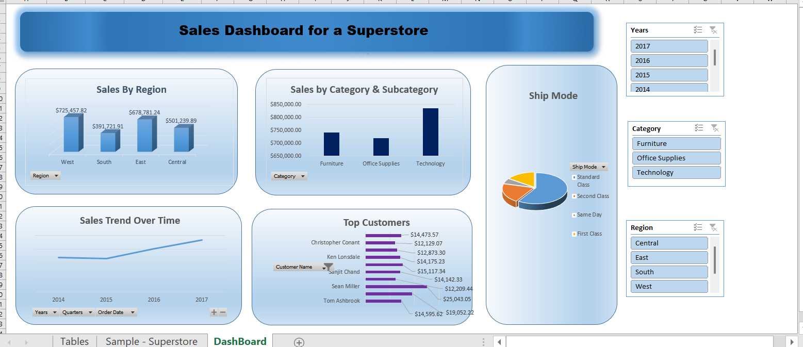

# Excel-Dashboard-Project---Sales-Analysis
This project is an Excel dashboard created using the Superstore dataset. 
Project Overview
This project is an Excel dashboard created using the Superstore dataset.  
It shows key insights about sales, categories, regions, and shipping modes.  

Features
- Data cleaning in Excel (duplicates removed, missing values handled).
- PivotTables for summarization.
- Interactive filters using slicers.
- Visual dashboard with KPIs, charts, and breakdowns.

Dashboard Preview

 Files
- `Superstore_Analysis.xlsx` → Main Excel dashboard file.
- `DashBoard.png` → Screenshot of the dashboard.
- `README.md` → Project description.

 Insights
- Technology category generated the highest sales.  
- Furniture category had lower sales margins.  
- Standard Class is the most common shipping method.  
- West region showed strong sales growth.  

